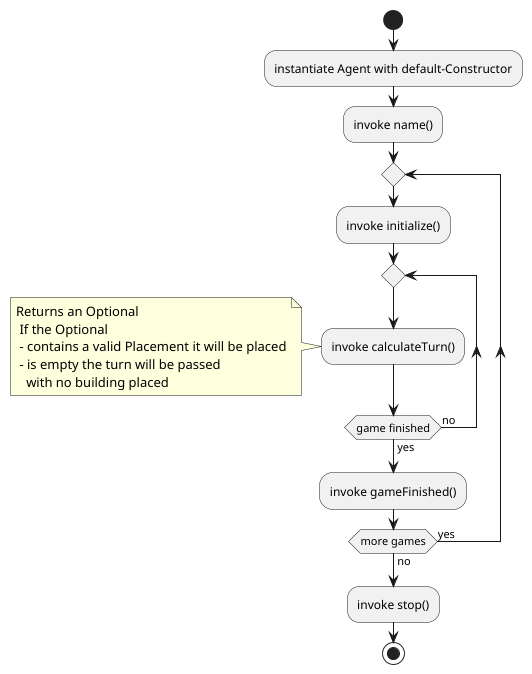

# A cathedral implementation in Java
[](http://unlicense.org/)
[](https://github.com/WerthersEchte/cathedral-ai/actions/workflows/codequality.yml)
[](https://javadoc.io/doc/io.github.werthersechte/cathedral-ai)

## About
This is a Java/Kotlin interface for creating an ai-agent playing cathedral (https://en.wikipedia.org/wiki/Cathedral_(board_game)).

## How to get
Add to use with gradle
- Kotlin
```
implementation("io.github.werthersechte:cathedral-ai:2.0.1")
```
- Groovy
```
implementation 'io.github.werthersechte:cathedral-ai:2.0.1'
```

## Agent as a Service
To expose your Agent as a Service(https://javadoc.scijava.org/Java21/java.base/java/util/ServiceLoader.html) do the following steps:

1. Create your Agent as a class that implements the Agent-Interface found in this repository
```
// Kotlin
package de.hawkiel.cathedral.ai.example

import de.fhkiel.ki.cathedral.ai.Agent
import de.fhkiel.ki.cathedral.game.Game
import de.fhkiel.ki.cathedral.game.Placement
import java.util.Optional

// This agent always passes its turn
class PassingAgent: Agent{
    override fun name(): String {
        return "IPass"
    }

    override fun calculateTurn(
        game: Game,
        timeForTurn: Int,
        timeBonus: Int
    ): Optional<Placement> {
        return Optional.empty<Placement>()
    }
}
```

2.
    1. Create a directory `META-INF` in your main->resources module
    2. Create a directory `services` in the `META-INF` directory
   
   In e.g. Intellij-Idea it should lock like this:  
   
   
3. Create a file named `de.fhkiel.ki.cathedral.ai.Agent`in the service folder
4. Write the **fully qualified class name** into the file, e.g. in ths case `de.hawkiel.cathedral.ai.example.PassingAgent`
5. Now a ServiceLoader can discover your Service in all exported jars

## Lifecycle

The Order functions are called on an agent  

